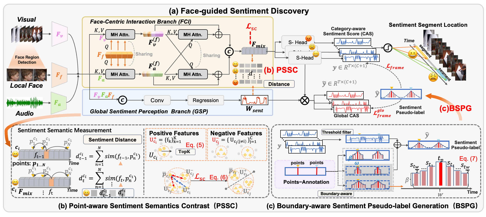

# FSENet: Face-Guided Sentiment Boundary Enhancement for Weakly-Supervised Temporal Sentiment Localization

**[Paper](https://arxiv.org/abs/2603.14750)**
｜ **[Code](https://github.com/CeilingHan/FSENet.git)**

## Overview

🎉 FSENet is accepted by CVPR 2026!

<p align="center">
  
</p>

## Abstract

Point-level weakly-supervised temporal sentiment localization (P-WTSL) aims to detect sentiment-relevant segments in untrimmed multimodal videos using timestamp sentiment annotations, which greatly reduces the costly frame-level labeling.
To further tackle the challenges of imprecise sentiment boundaries in P-WTSL, we propose the Face-guided Sentiment Boundary Enhancement Network **FSENet**, a unified framework that leverages fine-grained facial features to guide sentiment localization.
Specifically, our approach first introduces the Face-guided Sentiment Discovery (FSD) module, which integrates facial features into multimodal interaction via dual-branch modeling for effective sentiment stimuli clues;
We then propose the Point-aware Sentiment Semantics Contrast (PSSC) strategy to discriminate sentiment semantics of candidate points (frame-level) near annotation points via contrastive learning, thereby enhancing the model's ability to recognize sentiment boundaries.
At last, we design the Boundary-aware Sentiment Pseudo-label Generation (BSPG) approach to convert sparse point annotations into temporally smooth supervisory pseudo-labels.
Extensive experiments and visualizations on the benchmark demonstrate the effectiveness of our framework, achieving state-of-the-art performance under full supervision, video-level, and point-level weak supervision, thereby showcasing the strong generalization ability of our FSENet across different annotation settings.

## Getting Started

### 📋 Environment Requirements

- Python 3.9+
- PyTorch 2.0+

### 🚀 Installation

```bash
# Clone the repository
git clone https://github.com/CeilingHan/FSENet.git
cd FSENet

# Install dependencies
pip install -r core/requirements.txt
```

### 📁 Dataset Preparation

The project uses two datasets: CMU- MOSEI and TSL300, available on Hugging Face:

<https://huggingface.co/datasets/Cerilong/Sentiment_Localization/upload/main>

#### 💾 Download Dataset

```bash
# Using huggingface-cli
pip install huggingface-hub
huggingface-cli download Cerilong/Sentiment_Localization --local-dir ./dataset

# Or using Python
from huggingface_hub import snapshot_download
snapshot_download(
    repo_id="Cerilong/Sentiment_Localization",
    local_dir="./dataset",
    repo_type="dataset"
)
```

##### 📁 Dataset Structure

```
dataset/
├── CMU_SOMI/               # CMU_SOMI dataset
│   ├── features/       # Features directory
│   │   ├── train/      # Training set features
│   │   │   ├── rgb/    # RGB features
│   │   │   ├── logmfcc/ # MFCC features
│   │   │   └── img/    # Face features
│   │   └── test/       # Test set features
│   │       ├── rgb/    # RGB features
│   │       ├── logmfcc/ # MFCC features
│   │       └── img/    # Face features
│   ├── gt.json         # Ground truth annotations
│   ├── fps_dict.json   # Video frame rate information
│   ├── split_train.txt # Training set split
│   ├── split_test.txt  # Test set split
│   └── point_gaussian/ # Point annotations
└── VideoSenti/            # VideoSenti dataset
    └── ...             # Similar structure to CMU_SOMI
```

## 🔧 Model Training

### 1. Configuration

Modify the dataset path in `core/options.py`:

```python
parser.add_argument('--data_path', type=str, default='./dataset/VideoSenti')
```

#### 2. Training Script

Use `run_train.sh` to start training:

```bash
cd core
bash run_train.sh
```

Or run directly:

```bash
cd core
python main.py
```

### 📊 Evaluation

#### 1. Evaluation Script

Use `run_eval.sh` to evaluate the model:

```bash
cd core
bash run_eval.sh
```

Or run directly:

```bash
cd core
python main_eval.py --data_path ./dataset/VideoSenti --model_file ./models/train/model_seed_123.pkl
```

## 📝 Cite Us

If you find this work useful, please cite our paper:

```bibtex
@inproceedings{FSENet2026,
 title={Face-Guided Sentiment Boundary Enhancement for Weakly-Supervised Temporal Sentiment Localization}, 
      author={Cailing Han and Zhangbin Li and Jinxing Zhou and Wei Qian and Jingjing Hu and Yanghao Zhou and Zhangling Duan and Dan Guo},
      journal = {arXiv preprint arXiv:2511.13719},
      year={2026}
}
```

## 🙏 Acknowledgements

We referenced the repos below for the code.

- **TSL300 Dataset Contributors**: For creating and sharing the TSL300 dataset for sentiment localization research. [GitHub](https://github.com/nku-zhichengzhang/TSL300)
- **SF-Net Contributors**: For their pioneering work on single-frame supervision for temporal localization. [GitHub](https://github.com/Flowerfan/SF-Net)
- **Learning Action Completeness from Points Contributors**: For their insights on learning completeness from point annotations. [GitHub](https://github.com/Pilhyeon/Learning-Action-Completeness-from-Points)
- **HR-Pro Contributors**: For their work on hierarchical reliability propagation for point-supervised localization. [GitHub](https://github.com/pipixin321/HR-Pro)
- **Hugging Face**: For providing the platform to host our datasets, making them easily accessible to the research community.

